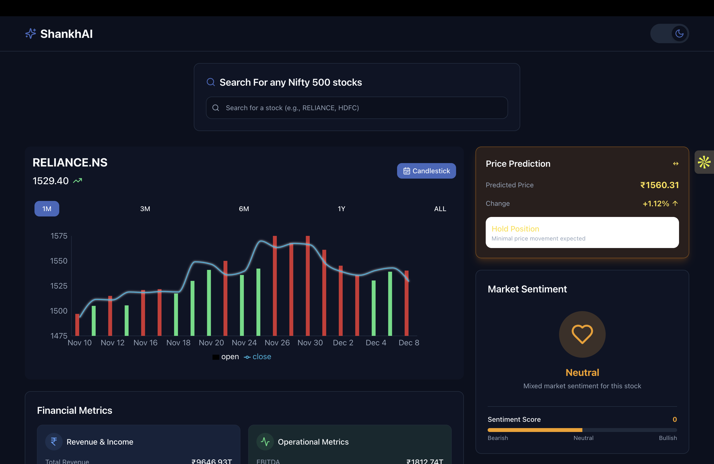
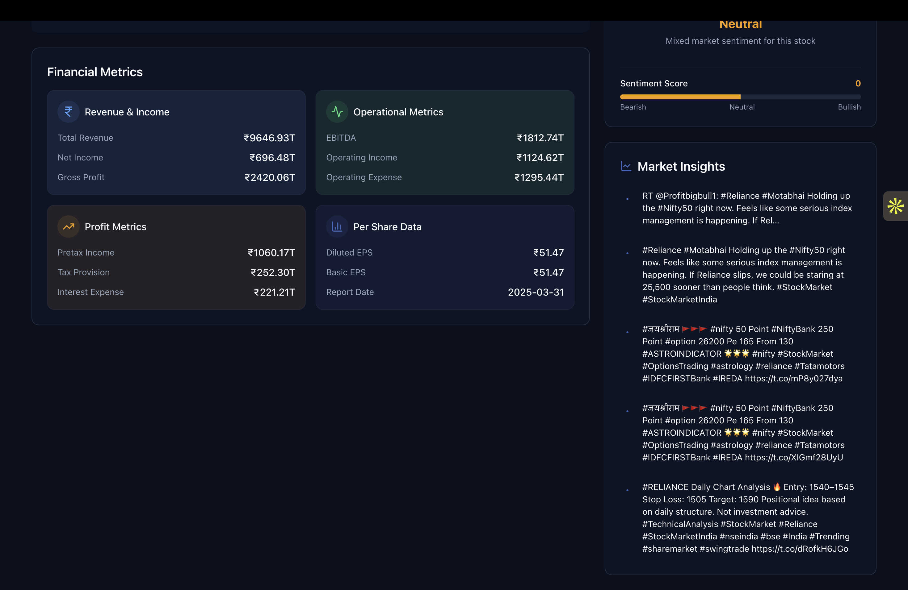

# Shankh.AI - AI-Powered Stock Price Forecasting & Analytics

[Live Demo: Shankh.AI](https://shankhbe.netlify.app/) 


**Shankh.AI** is a comprehensive financial forecasting platform developed by **Infinity Pool Pvt. Ltd.** that leverages Deep Learning to predict stock prices and market trends. Unlike traditional linear models, Shankh.AI utilizes advanced architectures like CNN-LSTM and Bi-LSTM with Attention mechanisms to capture complex market patterns, incorporating technical analysis, financial fundamentals, and market sentiment.

##  Key Features

*   **Predictive Analysis:** Forecasts daily stock prices and quarterly closing ranges using Deep Learning.
*   **Technical Analysis:** Real-time visualization of indicators like RSI, MACD, Bollinger Bands, and Moving Averages.
*   **Sentiment Analysis:** Analyzes Twitter data using **OpenAI (GPT-3.5)** and **Tweepy** to gauge market mood (Bullish/Bearish/Neutral).
*   **Financial Analysis:** Evaluates quarterly financial statements to generate long-term signals.
*   **Interactive Dashboard:** A clean, user-friendly UI built with React and Tailwind CSS.
*   **Chatbot Advisor:** Integrated AI assistant for financial queries.

##  Architecture

The system follows a modular architecture:
1.  **Data Acquisition:** Stock data (Yahoo Finance), Economic Indicators (FRED), Tweets (Twitter API).
2.  **Preprocessing:** Feature engineering, entropy calculation, and normalization.
3.  **Modeling:** 
    *   **CNN-LSTM:** For feature extraction and temporal dependency.
    *   **XGBoost-BiLSTM-Attention:** The best-performing model (RMSE: 16.31) for precise price prediction.
4.  **Deployment:** FastAPI backend serving predictions to a React frontend.

##  Tech Stack

### Frontend
*   **React.js** (Vite)
*   **Tailwind CSS**
*   **ApexCharts** (for financial graphing)

### Backend & AI
*   **Python**
*   **FastAPI** (Web Framework)
*   **TensorFlow / Keras** (Deep Learning Models)
*   **XGBoost** (Regression/Classification)
*   **OpenAI API** (Sentiment Analysis)
*   **Tweepy** (Twitter Data Scraping)

##  Project Structure

```bash
AI-Stock-Price-Forecasting/
├── backend/                 # FastAPI server and logic
│   ├── data/               # OCHLV CSV data
│   ├── models/             # Saved .h5 and .npy model files
│   ├── financial_signals/  # Quarterly prediction signals
│   └── main.py             # API Entry point
├── frontend/                # React application
│   ├── src/                # Components, pages, and hooks
│   └── public/             # Static assets
└── ...
```
## Model Performance

We evaluated multiple architectures. Our **XGBoost-BiLSTM-Attention** model outperformed others:

| Model | RMSE | MAE | Training Time |
|-------|------|-----|---------------|
| CNN-LSTM | 46.25 | 37.15 | 7 mins |
| **Bi-LSTM-Attention** | **16.31** | **11.62** | **15 mins** |

## Installation & Setup

### Prerequisites
*   Node.js & npm
*   Python 3.9+

### 1. Backend Setup
Navigate to the backend folder and install dependencies:

```bash
cd backend
python -m venv venv
source venv/bin/activate  # On Windows: venv\Scripts\activate
pip install -r requirements.txt
```

### Run the Server
```bash
uvicorn main:app --reload
```

### 2. Frontend Setup
```bash
cd frontend
npm install
npm run dev
```

Dashboard Interface

Model Results & Analysis
